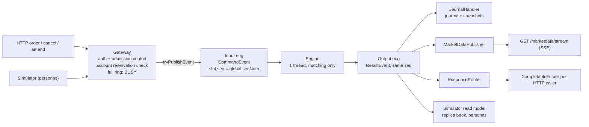

# Architecture

[Back to README](README.md)

Internals of the matching engine, the Disruptor pipeline, the participant API, the market-data feed and the market
simulator.

## Matching engine

A single-instrument, in-memory matching engine (`orderbook.MatchingEngine`, `orderbook.OrderBook`). It is
deterministic and single-threaded, uses integer prices (ticks) and quantities, and never uses floating point.

- **Commands:** `Place`, `Cancel` and `Amend` all go through `MatchingEngine.process(Command)` and produce events:
  `OrderPlaced`, `TradeExecuted`, `OrderCancelled`, `OrderAmended`, `OrderRejected`.
- **Matching:** price-time priority, with FIFO order taken from an engine-assigned `seqNum`. Trades execute at the
  resting (maker) order's price, and orders sweep across multiple price levels.
- **Order types:** `LIMIT` and `MARKET`.
- **Time in force:**
  - `GTC`: the unfilled remainder rests in the book.
  - `IOC`: the unfilled remainder is cancelled.
  - `FOK`: all-or-nothing, checked first with a dry run, so a rejected order leaves the book untouched.
- **Amend:** a quantity decrease at the same price keeps the order's queue position. A price change or quantity
  increase sends the order to the back of the queue, and it can cross the book like a new order.
- **Self-trade prevention:** cancel-taker. An incoming order that would match the same participant's resting order is
  cancelled, and the resting order is left alone.
- **Validation:** invalid input is returned as `OrderRejected` events and never thrown. This covers non-positive
  price or quantity, duplicate order IDs, and unknown order IDs.

The book stores each side as a `TreeMap` of price levels with a FIFO queue per level, plus a hash index for O(1) cancels.

## Journal, snapshots and recovery

`orderbook.journal.Journal` is an event-sourced log in a directory (`-Djournal.path=DIR` in the server, where
`JournalHandler` writes it from the output ring in global sequence order).

- **Format v2:** segments `journal-000001.log`, … start with `#orderbook-journal v2 base=<seq>`; each line is
  `<crc32 hex>:{"seq":N,"cmd":…}` (CRC32 of the JSON). Unversioned v1 JSON Lines journals are rejected, not
  silently read.
- **Snapshots:** `snapshot-<seq>.json` holds the complete engine state (every resting order with id, participant,
  side, type, TIF, price, remaining qty and seqNum; accepted IDs; seqNum and order-ID counters) covering exactly
  journal sequence `seq`. In the pipeline they are sequenced: `tryPublishSnapshot()` markers, every N commands
  (`setSnapshotInterval`, `-Djournal.snapshotEvery`, default 10000) and resets. The engine thread serializes the
  state into the result slot; the journal consumer writes it (temp file, fsync, atomic rename), then rotates to a
  new segment.
- **Recovery:** `Journal.recover()` loads the newest snapshot and replays only entries with `seq` > its `seq`; with no
  snapshot it replays every segment. A CRC or parse failure mid-segment is a hard corruption error; a torn or
  corrupt last line is dropped and truncated on the next append.
- **Durability (`-Djournal.durability`):** `FLUSH` (default) writes each line to the OS: survives a process crash,
  may lose recent commands on power loss or OS crash. `FSYNC` adds `FileChannel.force` every N commands or T ms,
  whichever is first (`-Djournal.fsyncEvery=64`, `-Djournal.fsyncMillis=10`): an OS crash loses at most the
  last unforced batch. Snapshots are always fsynced.
- **Retention:** covered segments and older snapshots are kept; `pruneCoveredSegments()` deletes them on demand.

## Pipeline

The engine runs behind an explicit [LMAX Disruptor](https://lmax-exchange.github.io/disruptor/) pipeline
(`orderbook.pipeline.DisruptorPipeline`). Matching logic is unchanged; the pipeline only decides who feeds the
engine, in what order, and who hears about the results.

- **Input ring (sequencer):** a preallocated, power-of-two `CommandEvent` ring with multiple producers. Every API
  call (browser, external clients and simulated participants alike) is authenticated and admission-checked first
  (see [Participant API](#participant-api)), then `Gateway` runs the user's account reservation check and claims a
  slot with `tryPublishEvent()`. The slot's sequence is the command's global `seqNum`.
- **Backpressure:** a full ring never blocks a producer; the command is rejected with `OrderRejected` reason
  `BUSY` and its reservation is released.
- **Engine:** a single `EventHandler` thread that only matches; no I/O. `BlockingWaitStrategy` on both rings.
- **Output ring (fan-out):** every result goes onto a second ring read by independent handlers, each on its own
  thread with its own cursor: the journal writer, the market-data publisher, the response router (completes the
  waiting HTTP caller's `CompletableFuture`, keyed by sequence) and the simulator's read model. A slow handler
  only falls behind. Matching waits only once a handler lags by a whole output ring, and producers then see `BUSY`.

## Participant API

Endpoints and an example are in the [README](README.md#participant-api).

- **Authentication:** keys live in an in-memory registry that maps each key to its participant ID. A missing or
  unknown key gets `401`, and touching another participant's order is rejected with `NOT_OWN_OPEN_ORDER`.
  The browser is `YOU` (participant 1). The page sets an `HttpOnly` session cookie holding a reserved key that can
  never be registered.
- **Admission control:** checks run in the gateway before anything is published to the input ring. Each
  participant has a token bucket of 200 messages/sec with a burst of 400 (orders, cancels and amends each cost one)
  and may have at most 100 open orders. A breach gets `429` with reason `RATE_LIMITED` or `MAX_OPEN_ORDERS`.
- **Blocking:** after 100 violations a participant gets `403 BLOCKED` on every call. `POST /api/reset` clears
  the counters.
- Responses carry the order ID, the global `seq` and the engine's events. `YOU` also gets its book and account view.

## Market data

`MarketDataPublisher` turns engine events into an aggregated (L2) feed, one message per global `seqNum`:

- `snapshot`: `{"type":"snapshot","seq":S,"bids":[[price,qty,orders],…],"asks":[…],"trades":[…],"events":[…]}`
- `delta`: `{"type":"delta","seq":N,"levels":[["a"|"u"|"r","B"|"S",price,qty,orders],…],"events":[…]}`. Trade
  prints are `TradeExecuted` entries in `events`. Prices are integer ticks.

`GET /marketdata/stream` is Server-Sent Events. Its first message is always a snapshot, taken under the same lock
that applies results, so there is no snapshot/subscribe race. After snapshot `S`, deltas arrive as `S+1`, `S+2`, …
with no holes. Any other sequence is a gap, and the client resyncs from a fresh snapshot. A slow client's backlog
is replaced by a single snapshot. The page keeps a local book replica from the snapshot plus deltas, and the
event log and trade tape filter the same stream. Account state is polled from `GET /api/account`.

## Market simulator

`orderbook.sim.Simulator` is an orchestrator of API clients. Each simulated participant runs on its own client thread,
registers through `POST /participants/register` and trades over HTTP with its own key and limits.

- **Turns:** each Poisson arrival deals one participant a turn: a snapshot of the market (reference price, top 10
  levels, its own orders), which its persona turns into authenticated order/cancel/amend calls.
- **Reproducibility:** runs are reproducible from a seed when participants run in-process (the static demo and
  tests).
- **Risk tolerance:** each participant is assigned a persona and a hidden `riskTolerance` between 0 and 1 when it
  joins. A market maker's spread and readiness to leave depend on it.

## Your account (`YOU`)

Every order from `YOU` is checked against its cash and share balance before it reaches the engine (the `Gateway`
account reservation check above). Buys reserve cash and sells reserve shares until the order fills or is cancelled;
fills settle at the trade price, and any unused reservation is refunded.
