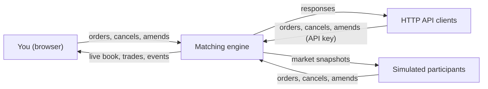

# devin-demo

A price-time priority limit order book in Java 17, with a market simulator that trades against it.

**[Live demo](https://arthuryan-k.github.io/devin-demo/)**

See [ARCHITECTURE.md](ARCHITECTURE.md) for internals (matching engine, Disruptor pipeline, market data).

## What is this

A limit order book is the core of an exchange: buyers and sellers post orders at the prices they are willing to
trade, and the matching engine pairs them up, best price first and, at the same price, first come first served. This
repo is a single-instrument order book that supports limit and market orders, good-till-cancelled,
immediate-or-cancel and fill-or-kill orders, amends, cancels and self-trade prevention, with every order recorded in
a crash-safe journal. Around it sits an interactive demo: a simulated market full of trading bots, which you can
join and trade against from your browser or over an HTTP API.

## Using the demo

1. Open the [live demo](https://arthuryan-k.github.io/devin-demo/) and press **Simulate** to start the market. The
   simulation starts stopped.
2. You trade as participant **YOU**, with a cash and share balance.
3. Place limit or market orders, cancel them, or amend their price and quantity.
4. Watch the order book, the trade tape and the event log update live as your orders and the simulated
   participants' orders are matched.



## Participant API

Every participant, including each simulated one, is an API client identified by an API key.

| Endpoint | Auth | Purpose |
|---|---|---|
| `POST /participants/register` (optional form field `name`) | none | Returns `{"participantId":1001,"label":"name-1001","apiKey":"ob_…"}` |
| `POST /api/orders` (`side`, `type`, `price`, `qty`, `timeInForce`) | `X-Api-Key` | Place an order as that participant |
| `PATCH /api/orders/{id}` (`price` and/or `qty`) | `X-Api-Key` | Amend one of your resting orders |
| `DELETE /api/orders/{id}` | `X-Api-Key` | Cancel one of your resting orders |

```
KEY=$(curl -s -d name=alice localhost:8080/participants/register | sed 's/.*"apiKey":"\([^"]*\)".*/\1/')
curl -s -H "X-Api-Key: $KEY" -d 'side=BUY&type=LIMIT&price=99.50&qty=10' localhost:8080/api/orders
```

- A missing or unknown key gets `401`; you can only amend or cancel your own orders.
- Each participant is limited to 200 messages/sec (burst 400) and 100 open orders; breaches get `429`.
- After 100 violations a participant is blocked with `403`. `POST /api/reset` clears the counters.

## Market simulator

- **Order flow:** orders arrive as a Poisson process (exponential inter-arrival times) at an adjustable rate.
- **Reference price:** a hidden fair value follows a random walk with rare jumps. Each jump starts a volatility
  shock that fades out over 12 seconds. During a shock, prices move more, market makers quote wider, and
  participants are more likely to leave.
- **Participants:** 2–8 are active at once. They join and leave over time, with more leaving after shocks. A
  participant cancels its resting orders before leaving.

| Persona | Share | Strategy |
|---|---|---|
| Market maker | ~58% | Posts small GTC quotes on both sides near the reference price. It re-quotes as the price drifts and refills an empty side of the book. Its spread and readiness to leave depend on its risk tolerance. It tracks the net of its own fills and shrinks its quotes on the side that would add to its inventory. |
| Aggressive taker | ~19% | Sends market and IOC orders, sometimes sweeping several levels. It follows recent drift, buying 55% of the time after the price rises and 45% after it falls. |
| Maintenance trader | ~19% | Keeps a few resting orders and cancels, resizes or reprices them. |
| Whale | ~4% | Occasionally sends a large market sweep, which triggers a volatility shock. |

## Your account

- Buys reserve cash and sells reserve shares until the order fills or is cancelled.
- Cash and shares can never go negative, so short selling is not allowed.
- Session gain/loss is tracked at average cost: realized on sells, unrealized on held shares marked at the last trade.

## Build and run

```
mvn test                              # engine, simulator, account, server and property tests
mvn compile exec:java                 # local server at http://localhost:8080/ (SIM_SEED=42 for a fixed seed)
```
